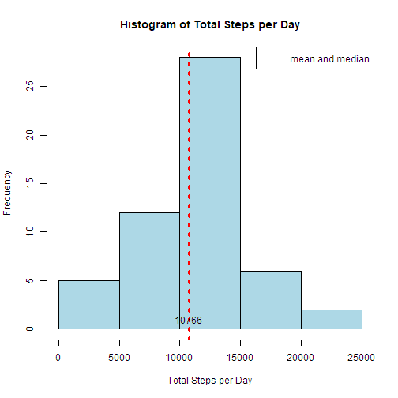
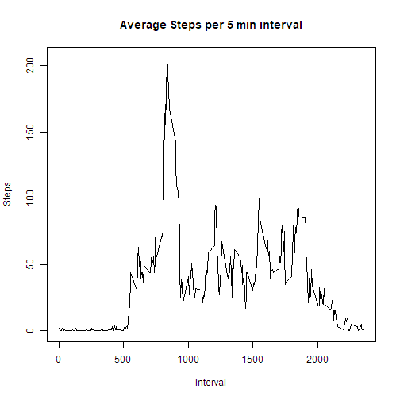
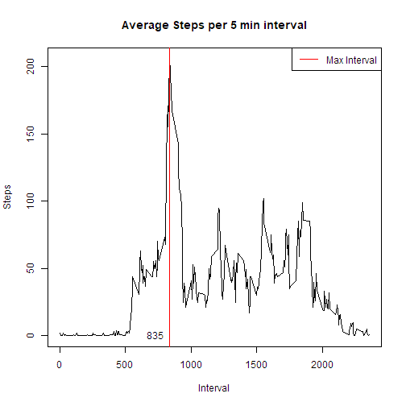
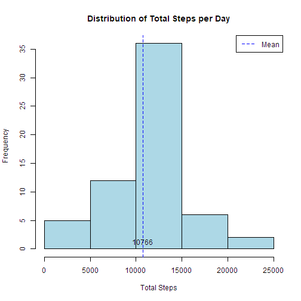
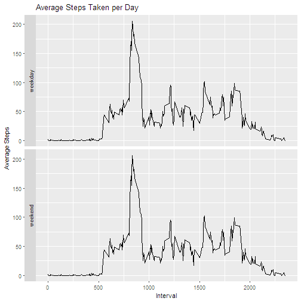

### Reproducible Research Report 1
#### Analyzing data from the Activity Monitoring Dataset

First, I will set my working directory and download the data using the data.table package

```r
setwd("~/R/RepData_PeerAssessment1-master")
```


```r
library(data.table)#for subsetting
library(dplyr) #for data cleaning and manipulation
library(ggplot2) #for visualization
library(knitr)# to create the html report
opts_chunk$set(fig.path = "./figure/")
data <- fread("activity.csv")
head(data)
```

```
##    steps       date interval
## 1:    NA 2012-10-01        0
## 2:    NA 2012-10-01        5
## 3:    NA 2012-10-01       10
## 4:    NA 2012-10-01       15
## 5:    NA 2012-10-01       20
## 6:    NA 2012-10-01       25
```
Taking a quick look at the data with summary


```r
summary(data)
```

```
##      steps            date              interval     
##  Min.   :  0.00   Length:17568       Min.   :   0.0  
##  1st Qu.:  0.00   Class :character   1st Qu.: 588.8  
##  Median :  0.00   Mode  :character   Median :1177.5  
##  Mean   : 37.38                      Mean   :1177.5  
##  3rd Qu.: 12.00                      3rd Qu.:1766.2  
##  Max.   :806.00                      Max.   :2355.0  
##  NA's   :2304
```
Checking the class of the 'date' column

```r
class(data$date)
```

```
## [1] "character"
```
Downloading the lubridate library to convert the date column into 'date' class

```r
library(lubridate)
data$date <- ymd(data$date)
print(class(data$date))
```

```
## [1] "Date"
```


### What is the mean total number of steps taken per day?

#### Calculate the total number of steps per day.
Using the data.table package, I will aggregate the data by date and find the total steps per day.

```r
totalsteps <- data[,sum(steps),date]
head(totalsteps)
```

```
##          date    V1
## 1: 2012-10-01    NA
## 2: 2012-10-02   126
## 3: 2012-10-03 11352
## 4: 2012-10-04 12116
## 5: 2012-10-05 13294
## 6: 2012-10-06 15420
```
The mean is 

```r
mean(totalsteps$V1,na.rm=TRUE)
```

```
## [1] 10766.19
```
The median is

```r
median(totalsteps$V1,na.rm=TRUE)
```

```
## [1] 10765
```


```r
#Creating the histogram and adding labels
 hist(totalsteps$V1,xlab="Total Steps per Day",main="Histogram of Total Steps per Day",col="lightblue")

#Adding a vertical line with to indicate the mean
abline(v=c(mean(totalsteps$V1,na.rm=TRUE)), col=c("red"),lwd=3,lty=3)

text(x=mean(totalsteps$V1,na.rm=TRUE),y=0,"10766",pos=3)

#Adding the legend for ease of interpretation
legend("topright","mean and median",col="red",lty=3)
```


#### What is the average daily activity patterrn?

I will use the data.table package to get the average steps per interval.


```r
avgsteps <- data[,round(mean(steps,na.rm=TRUE)),interval]
head(avgsteps)
```

```
##    interval V1
## 1:        0  2
## 2:        5  0
## 3:       10  0
## 4:       15  0
## 5:       20  0
## 6:       25  2
```


```r
plot(x = avgsteps$interval,y=avgsteps$V1,type='l', xlab="Interval",ylab="Steps",main="Average Steps per 5 min interval")
```




```r
#subset the avgsteps dataset to get the maximum interval
max_interval <- avgsteps[which(avgsteps$V1==max(avgsteps$V1))] 
max_interval
```

```
##    interval  V1
## 1:      835 206
```
Plotting the vertical line to show that the interval with the maximum number of steps is 835.

```r
#Subset the dataset to calculate the mean steps per interval
avgsteps <- data[,round(mean(steps,na.rm=TRUE)),interval]

plot(x = avgsteps$interval,y=avgsteps$V1,type='l', xlab="Interval",ylab="Steps",main="Average Steps per 5 min interval")

#Adding text to display the max interval
text(max_interval$interval,0,"835",pos=2)

#Adding the legend for ease of interpretation
legend("topright","Max Interval",col="red",lty=1)

#Adding the vertical line at the maximum interval 835
abline(v=max_interval$interval,col="red")
```



###   Imputing Missing Values
##### Total missing values in the dataset


```r
#Total missing values in the dataset
sum(is.na(data)) 
```

```
## [1] 2304
```


```r
#Total missing values in the interval column
(sum(is.na(data$interval))) 
```

```
## [1] 0
```


```r
#Total missing values in the steps column
print(sum(is.na(data$steps))) 
```

```
## [1] 2304
```

To impute the values in the steps column I will fill in the missing values using the average steps for that interval.

I will use the avgsteps table as a lookup table. 
NA values in the 'steps' column of 'data' are replaced with the average steps for its corresponding interval.

```r
#Using dplyr, add the replace_steps column with filled in values
#If the value in the steps column is missing, use the match function to find its appropriate average steps
#Pass the new dataset to the mutate function using the pipe operator
#Drop the old steps column
no_na <- mutate(data,replace_steps = ifelse(is.na(steps),avgsteps$V1[match(interval,avgsteps$interval)],steps)) %>% mutate(steps=NULL)

#Compare the two datasets (imputed data(no_na) vs missing data(data))
print(head(no_na))
```

```
##         date interval replace_steps
## 1 2012-10-01        0             2
## 2 2012-10-01        5             0
## 3 2012-10-01       10             0
## 4 2012-10-01       15             0
## 5 2012-10-01       20             0
## 6 2012-10-01       25             2
```

```r
print(head(data))
```

```
##    steps       date interval
## 1:    NA 2012-10-01        0
## 2:    NA 2012-10-01        5
## 3:    NA 2012-10-01       10
## 4:    NA 2012-10-01       15
## 5:    NA 2012-10-01       20
## 6:    NA 2012-10-01       25
```
#### Make a histogram of the total number of steps taken each day


```r
#Convert the no_na from a data.frame object to a data.table for ease of subsetting
no_na <- as.data.table(no_na) 

# Select all rows and sum the replace_steps column while grouping by date
plot_data <- no_na[,sum(replace_steps),date] 

#Create a histogram using the plot_data table
hist(plot_data$V1,xlab="Total Steps",col="lightblue", main="Distribution of Total Steps per Day") 

#Add a vertical line to indicte the mean
abline(v=c(mean(plot_data$V1,mean(totalsteps$V1,na.rm=TRUE))),col=c("blue","red"),lty=2)
text(x=mean(plot_data$V1),y=0,"10766",pos=3)

# Add the legend for ease of interpretation
legend("topright","Mean",col="blue",lty=2)
```




```r
print(mean(plot_data$V1))
```

```
## [1] 10765.64
```

```r
print(median(plot_data$V1))
```

```
## [1] 10762
```

There is little to no difference between the means of the data with and without na values.

```r
#Imputed mean
mean(plot_data$V1) 
```

```
## [1] 10765.64
```

```r
#Mean without na
mean(totalsteps$V1,na.rm=TRUE) 
```

```
## [1] 10766.19
```


#### Are there differences in activity patterns between weekdays and weekends?

```r
#Create a list of weekdays
days <- c("Monday","Tuesday","Wednesday","Thursday","Friday") 

#Check if each date is in the weekdays list and print weekday or weekends correspondingly
no_na <- mutate(no_na,type_of_day = ifelse(weekdays(no_na$date) %in% days,"weekday","weekend")) 

head(no_na)
```

```
##         date interval replace_steps type_of_day
## 1 2012-10-01        0             2     weekday
## 2 2012-10-01        5             0     weekday
## 3 2012-10-01       10             0     weekday
## 4 2012-10-01       15             0     weekday
## 5 2012-10-01       20             0     weekday
## 6 2012-10-01       25             2     weekday
```


```r
#Subset no_na by selecting the date and type_of day columns,
#Calculate the mean of the replace_steps column and group by interval
no_na <- as.data.table(no_na)
plotting_data <- no_na[,.(date,type_of_day,round(mean(replace_steps))),.(interval)]
head(plotting_data)
```

```
##    interval       date type_of_day V3
## 1:        0 2012-10-01     weekday  2
## 2:        0 2012-10-02     weekday  2
## 3:        0 2012-10-03     weekday  2
## 4:        0 2012-10-04     weekday  2
## 5:        0 2012-10-05     weekday  2
## 6:        0 2012-10-06     weekend  2
```
#### Finally, make a panel plot containing a time series plot of the 5-minute interval (x-axis) and the average number of steps taken
#### Average the steps across all weekday days or weekend days (y-axis).

```r
p <- plotting_data %>% ggplot(aes(interval,V3)) 
p + geom_line() + facet_grid(type_of_day~.,switch = "y") + ylab("Average Steps") + xlab("Interval") + ggtitle("Average Steps Taken per Day")
```



